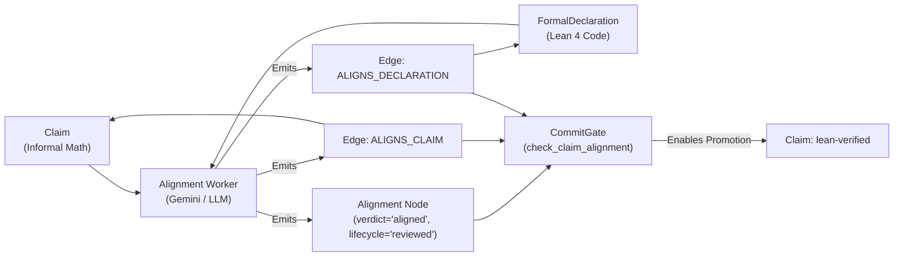

# Statement Alignment Worker (`src/alignment`)

The **Statement Alignment Worker** audits and certifies semantic equivalence between informal mathematical claims and formal Lean 4 declarations according to **Technical Design §5.4 and §7.6**.

In this architecture, an informal `Claim` and a Lean `FormalDeclaration` are separate objects in the proof metagraph. A Lean proof verifies an informal claim **only when** an alignment record with verdict `aligned` and lifecycle `reviewed` links them.

---

## 1. System Pipeline & Role



Without statement alignment, an ATP system could prove a false informal claim by formalizing a weakened, trivial theorem (e.g. adding unstated hypotheses like $p > 2$). `CommitGate` enforces that no claim can reach `lean-verified` without an accepted alignment record.

---

## 2. Core Modules

| Module | Description |
|---|---|
| **[`models.py`](models.py)** | Defines `AlignmentCriteria` (the 8 §7.6 dimensions), `AlignmentReviewRequest` (with automatic SHA-256 hashing), `AlignmentReviewResult`, and schema-compliant `AlignmentRecord`. |
| **[`reviewer.py`](reviewer.py)** | Contains `LLMAlignmentReviewer` (real reasoning auditor) and `RuleBasedAlignmentReviewer` (fast deterministic baseline). |
| **[`llm_client.py`](llm_client.py)** | Out-of-the-box LLM clients: **`GeminiLLMClient`** (native Google Generative Language API via `.env`), **`HTTPLLMClient`** (OpenAI / DeepSeek / vLLM compatible), **`CallableLLMClient`**, and **`MockLLMClient`**. |
| **[`prompts.py`](prompts.py)** | System prompt and formatted prompt envelopes enforcing structured JSON output across all 8 §7.6 audit criteria. |
| **[`worker.py`](worker.py)** | `AlignmentWorker` implementing `WorkerClass.ALIGNMENT_REVIEWER`. Provides `build_alignment_proposal()` for `CommitGate` and `build_worker_result()` for scheduler integration. |

---

## 3. The 8 Review Checkpoints (§7.6)

Every review systematically checks:
1. **Quantifier Order**: Preserves binder sequence ($\forall x \exists y$ vs $\exists y \forall x$).
2. **Domains & Coercions**: Validates types and subset bounds without unintended coercions.
3. **Hidden Assumptions**: Detects unstated assumptions of finiteness, non-emptiness, or decidability.
4. **Universe & Typeclasses**: Checks appropriateness of Lean typeclass instances (`[Group G]`, `[Field K]`).
5. **Classical vs. Constructive**: Checks whether noncomputable classical logic changes the claim's content.
6. **Relative Strength**: Classifies the relation as `exact`, `strengthening`, `weakening`, `reformulation`, or `mismatch`.
7. **Definition Faithfulness**: Ensures Lean library definitions match the intended mathematical concepts.
8. **Target Implication**: Confirms that proving the formal theorem directly implies the informal claim.

---

## 4. Integration with `CommitGate` & Schemas

Proposals emitted by the worker strictly conform to all gate invariants:
- **Authority**: Operates under `worker_class = "alignment-reviewer"`.
- **Edge Endpoints**: `ALIGNS_CLAIM` maps `("Alignment", "Claim")`; `ALIGNS_DECLARATION` maps `("Alignment", "FormalDeclaration")`.
- **Idempotency**: Generates deterministic edge IDs (`<alignment_id>-><target_id>:<REL_TYPE>`).
- **Soundness Gate**: Produces `lifecycle = "reviewed"` and `verdict = "aligned"`, enabling `check_claim_alignment` to pass on claim promotions.
- **JSON Schemas**:
  - `AlignmentRecord.to_dict()` validates against `schemas/statement-alignment.schema.json`.
  - `build_worker_result()` validates against `schemas/worker-result.schema.json`.

---

## 5. Usage Examples

### Option A: Using Google Gemini (Native `.env` Integration)

```python
import os
from dotenv import load_dotenv
from alignment import (
    AlignmentReviewRequest,
    AlignmentWorker,
    GeminiLLMClient,
    LLMAlignmentReviewer,
)
from commit_gate.gate import CommitGate

load_dotenv()

# 1. Initialize Gemini client (reads GEMINI_API_KEY from .env automatically)
llm_client = GeminiLLMClient(model="gemini-flash-lite-latest")
reviewer = LLMAlignmentReviewer(llm_client=llm_client, reviewer_id="gemini-critic-1")
worker = AlignmentWorker(actor="alignment-reviewer-agent", reviewer=reviewer)

# 2. Prepare review request
request = AlignmentReviewRequest(
    proof_id="p1",
    claim_id="p1/c-1",
    declaration_id="p1/fd-1",
    informal_statement="For all natural numbers a and b, a + b = b + a.",
    formal_statement="theorem add_comm (a b : Nat) : a + b = b + a",
    imports=("Mathlib.Data.Nat.Basic",),
    namespace="Nat",
)

# 3. Perform live review and generate CommitGate Proposal
result, proposal = worker.run_review(
    request=request,
    alignment_id="p1/al-1",
    base_revision=1,
    lease_id="lease-align-1",
    fencing_token=fencing_token,
)

print("Verdict:", result.verdict)          # AlignmentVerdict.ALIGNED
print("Relation:", result.criteria.relation) # "exact"

# 4. Submit to CommitGate
commit_result = gate.commit(proposal)
assert commit_result.accepted
```

### Option B: Using OpenAI / DeepSeek / Local vLLM

```python
from alignment import AlignmentWorker, HTTPLLMClient, LLMAlignmentReviewer

llm_client = HTTPLLMClient(
    endpoint_url="https://api.openai.com/v1/chat/completions",
    api_key=os.getenv("OPENAI_API_KEY"),
    model="gpt-4o",
)
reviewer = LLMAlignmentReviewer(llm_client=llm_client)
worker = AlignmentWorker(actor="llm-alignment-worker", reviewer=reviewer)
```

---

